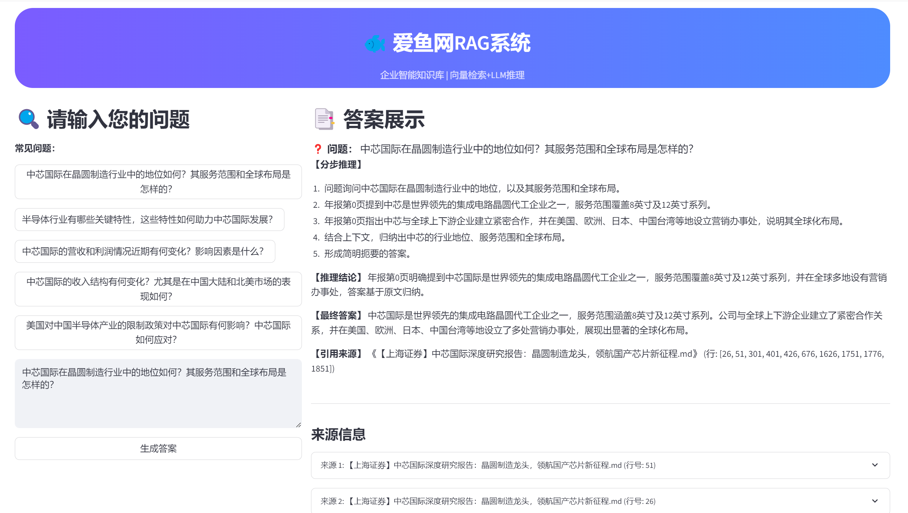

# RAG_System - 企业智能知识库


本项目是一个基于 **检索增强生成 (Retrieval-Augmented Generation, RAG)** 的企业级智能知识库问答系统。它能够高效地处理本地PDF格式的文档（如金融研报、法律文书、技术手册等），将其转化为可检索的知识库，并利用大型语言模型（LLM）提供精准、忠于原文的问答体验。

## ✨ 项目亮点

- **端到端解决方案**: 提供从PDF文档解析、数据处理、向量化到Web界面问答的完整流程。
- **本地化处理**: 所有文档解析和数据处理均在本地完成，不依赖外部付费解析服务，保证数据私密性。
- **先进的RAG架构**: 结合了高效的向量检索与强大的LLM（如通义千问），确保回答既相关又准确。
- **友好的用户界面**: 基于Streamlit构建了简洁美观、易于操作的Web界面，支持预设问题和实时问答。
- **高可扩展性**: 代码结构清晰，模块化设计，方便替换或扩展数据处理、模型等组件。

## 示例界面

> 示例演示网址：[http://47.109.81.57:8501/](http://47.109.81.57:8501/)



> 上图为本系统的实际Web界面示例，界面简洁美观，支持PDF知识库问答。

## 🏛️ 技术架构

系统的工作流程主要分为数据准备、数据处理、RAG问答和前端界面四个阶段，如下图所示：


## 🚀 快速开始

请按照以下步骤在您的本地环境中部署和运行本项目。

### 1. 环境准备

- **Git**: 确保您的系统已安装 Git。
- **Python**: 推荐使用 Python 3.10 或更高版本。

### 2. 克隆项目

```bash
git clone <your-repository-url>
cd RAG_System
```

### 3. 创建并激活虚拟环境

为了保持项目依赖的隔离，强烈建议使用虚拟环境。

```bash
# 创建虚拟环境
python -m venv env

# 激活虚拟环境
# Windows
.\env\Scripts\activate
# macOS / Linux
source env/bin/activate
```

### 4. 安装依赖

```bash
pip install -r requirements.txt
```

### 5. 配置API Key

本项目需要使用大型语言模型API（如阿里云通义千问）。

1.  复制配置模板文件：
    ```bash
    # Windows
    copy .env.example .env
    # macOS / Linux
    cp .env.example .env
    ```

2.  编辑 `.env` 文件，填入您的API Key：
    ```
    # 访问 https://dashscope.console.aliyun.com/apiKey 获取
    DASHSCOPE_API_KEY="sk-xxxxxxxxxxxxxxxxxxxxxxxxxxxxxxxx"
    ```

## 📖 使用指南

> 示例演示网址：[http://47.109.81.57:8501/](http://47.109.81.57:8501/)

### 1. 准备数据

将您需要处理的所有PDF文件放入 `data/stock_data/pdf_reports/` 目录下。

### 2. 处理数据（创建知识库）

运行以下命令，对PDF进行解析、分块和向量化，构建知识库。

```bash
python -m src.pipeline
```
该命令会执行完整的ETL（提取、转换、加载）流程，处理完成后，向量数据库会保存在 `data/stock_data/databases/` 目录下。

> **注意**: 每次新增或删除PDF文件后，都需要重新运行此命令来更新知识库。

### 3. 启动问答Web界面

```bash
streamlit run app_streamlit.py
```

命令执行成功后，浏览器会自动打开一个本地网址（通常是 `http://localhost:8501`），您现在可以开始向您的知识库提问了！

## 📁 目录结构

```
RAG_System/
├── data/
│   └── stock_data/
│       ├── pdf_reports/     # 存放原始PDF文件
│       ├── databases/         # 存放生成的向量数据库
│       └── questions.json     # 预设问题文件
├── src/                     # 核心源代码目录
│   ├── pipeline.py          # 数据处理和问答的核心流程编排
│   ├── ingestion.py         # 数据向量化与索引构建
│   ├── retrieval.py         # 检索模块
│   ├── reranking.py         # Rerank模块
│   ├── pdf_parsing.py       # PDF解析逻辑
│   ├── text_splitter.py     # 文本分块逻辑
│   └── ...                  # 其他辅助模块
├── app_streamlit.py         # Streamlit Web应用主文件
├── main.py                  # 命令行接口，用于数据处理
├── requirements.txt         # Python依赖列表
├── .env.example             # 环境变量配置模板
└── README.md                # 项目说明文档
```

## ☁️ 部署到服务器

若要将此应用部署到云服务器，请参考以下概要步骤：
1.  **准备云服务器** (如阿里云ECS)，并配置好安全组（开放22, 80, 443端口）。
2.  **配置域名解析**，将您的域名指向服务器公网IP。
3.  在服务器上**部署运行环境**，包括Python、Git等，并拉取项目代码。
4.  使用 **Nginx** 作为反向代理，将来自80端口的HTTP请求转发到Streamlit应用（通常运行在8501端口）。
5.  使用 **`systemd`** 或其他进程管理工具（如`supervisor`, `pm2`）将Streamlit应用作为后台服务持久化运行。
6.  **(推荐)** 使用 **Certbot** 为您的域名配置免费的HTTPS证书，实现安全访问。

## 📜 开源许可

本项目采用 [MIT License](LICENSE) 开源许可。

---

## 免责声明

本项目所用的所有PDF文档均来源于互联网，仅用于技术交流和学习研究，不用于任何商业用途。如有侵权请联系删除。